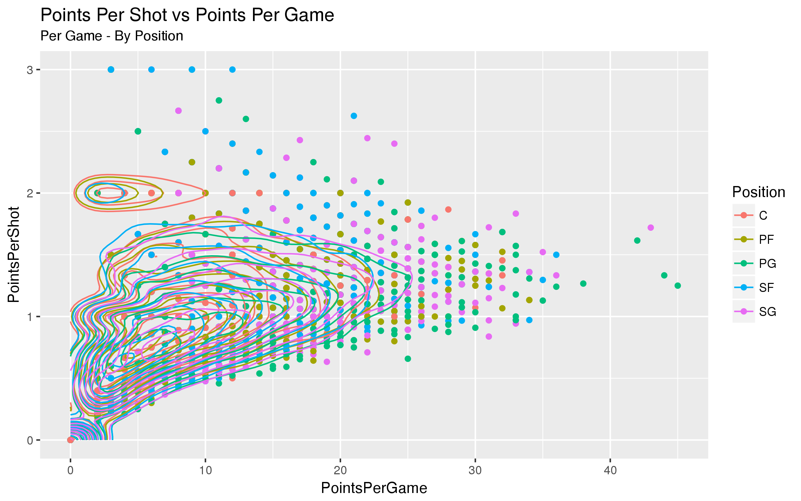

```{r setup, include=FALSE}
knitr::opts_chunk$set(echo = FALSE)
knitr::opts_chunk$set(warning = FALSE)
knitr::opts_chunk$set(message = FALSE)
config <- quote({
Sys.setenv(MAKE = 'make -j 8')
library(MASS)
library(tidyverse)
library(dplyr)
library(ggplot2)
library(stringr)
library(magrittr)
library(data.table)
library(lubridate)
library(RPostgreSQL)
library(plotly)
#library(rbokeh)
library(jsonlite)
library(htmltools)
library(glmnet)
library(epitools)
library(broom)
library(lme4)
library(sjPlot)
library(parallel)
library(car)
library(DescTools)
library(outliers)
library(corrgram)
library(grid)
library(gridExtra)
library(gtable)
  })
eval( config )
load('working.RData')
load('l.p.RData')
load('d.m.results.RData')
#
```

## Efficiency vs Effectiveness

```{r, fig.align='center' , fig.width=10 , fig.height=8 }
p <- 
  d %>%
    select( Player , Game , Position , Points , Scored ) %>% 
    group_by( Player , Game , Position ) %>% 
    summarise( PointsPerGame = sum( Points ) , PointsPerShot = mean( Points )  ) %>% {
    ggplot( . , aes( PointsPerGame , PointsPerShot , colour = Position ) ) + 
    geom_point() + 
    geom_density_2d( ) + 
    ggtitle( 'Points Per Shot vs Points Per Game' , subtitle = 'Per Game - By Position')  } 
p
# %>% 
    # ggplotly
```

## EDA: Quick Look

```{r, fig.align='center' , fig.width=10 , fig.height=8 }
p <- 
d %>% 
    .[ , .( Scored , ShotType , ShotDistance , ClosestDefenderDistance , ShotClock , 
            Dribbles = as.numeric( Dribbles ) , TouchTime , GameClock , ShotDistanceClass , PositionDistClass ) ] %>% 
    .[ !is.na( ShotClock ) ] %>% 
    .[ TouchTime >= 0  ] %>% 
    melt( id.vars = c('Scored' , 'ShotType' , 'ShotDistanceClass' , 'PositionDistClass' ) ) %>% 
    .[ , variable := factor( variable ) ] %>% 
    { ggplot( . , aes( value , colour = ShotDistanceClass , group = ShotDistanceClass ) ) + 
    facet_wrap(  ~ variable , scales = 'free' ) + geom_histogram( bins = 30 ) +
    ggtitle( 'Histograms by Shot Distance (Near vs Far)' )  } 
p
# %>% 
    # ggplotly
```


## Focus: Efficiency

Difficulties:  

- Too many factors - extremely high paced dynamic environment  
- Factors effect different players and different positions differently  
- Models treat every player the same  

## Model: Shot Distance & Defender Distance on Scoring

- Type: Binary Logistic Regression with random effects
- Fixed: Shot Distance & Defender Distance 
- Random: Shot Distance + Defender Distance / Player / Game
- Partitioning: Position & Near vs Far Shot
  - Position: 5 Positions
  - Distance: Near (<15ft) vs Far (>=15ft)

## Results {.smaller}

```{r, eval=FALSE, include=FALSE}
#l.m.summaries[[1]]
sjt.glmer(l.m.glmer[[1]] ,
          show.hoslem = T ,
          show.icc = F ,
          show.header = T ,
          show.family = T ,
          show.re.var = F ,
          cell.spacing = 0.1 )
```

```
Generalized linear mixed model fit by maximum likelihood (Laplace Approximation) ['glmerMod']
Family: binomial  ( logit )
Formula: Scored ~ ShotDistance * ClosestDefenderDistance + (ShotDistance | Player/Game) + (ClosestDefenderDistance | Player/Game)
Control: glmerControl(optimizer = c("bobyqa", "bobyqa"), optCtrl = list(maxfun = 2e+05))

     AIC      BIC   logLik deviance df.resid 
 19800.3  19922.4  -9884.1  19768.3    15293 

Scaled residuals: 
    Min      1Q  Median      3Q     Max 
-4.2368 -0.9367  0.4939  0.8695  2.5030 

Random effects:
 Groups        Name                    Variance  Std.Dev. Corr 
 Game.Player   (Intercept)             2.249e-05 0.004742      
               ClosestDefenderDistance 1.842e-06 0.001357 -1.00
 Game.Player.1 (Intercept)             1.259e-01 0.354873      
               ShotDistance            4.065e-03 0.063754 -1.00
 Player        (Intercept)             1.475e-02 0.121447      
               ClosestDefenderDistance 3.087e-03 0.055562 -0.80
 Player.1      (Intercept)             8.337e-02 0.288734      
               ShotDistance            1.439e-03 0.037933 -0.85
Number of obs: 15309, groups:  Game:Player, 2502; Player, 50

Fixed effects:
                                      Estimate Std. Error z value Pr(>|z|)    
(Intercept)                           0.096380   0.081172   1.187  0.23509    
ShotDistance                         -0.149220   0.013064 -11.422  < 2e-16 ***
ClosestDefenderDistance               0.377284   0.024965  15.113  < 2e-16 ***
ShotDistance:ClosestDefenderDistance -0.008755   0.003051  -2.870  0.00411 ** 
---
Signif. codes:  0 ‘***’ 0.001 ‘**’ 0.01 ‘*’ 0.05 ‘.’ 0.1 ‘ ’ 1

Correlation of Fixed Effects:
            (Intr) ShtDst ClssDD
ShotDistanc -0.792              
ClsstDfndrD -0.702  0.454       
ShtDstn:CDD  0.648 -0.742 -0.763
convergence code: 0
unable to evaluate scaled gradient
Model failed to converge: degenerate  Hessian with 2 negative eigenvalues
```


## Results (Continued)

```{r, eval=FALSE, fig.align='center', fig.width=7, include=FALSE}
library(png)
library(grid)
img <- readPNG('estimates.png')
grid.raster(img)
img <- readPNG('pvalues.png')
grid.raster(img)
```

```{r, eval=FALSE, fig.align='center', fig.height=3, fig.width=13, include=FALSE}
  l.tg <- list( 
    estimates = {
      d.m.results %>% 
      filter( !is.na( p.value ) ) %>% 
      select( PositionShotDistClass , Term = term , Estimate = estimate , PValue = p.value , Position , DistanceGroup = ShotDistClass ) %>% 
      mutate( Estimate = sprintf( '%.3f' , Estimate  ) ) %>% 
      dcast( DistanceGroup + Term ~ Position , value.var = 'Estimate' ) %>% 
        tableGrob( rows = NULL ) %>% 
        gtable_add_rows( 
          heights = unit( 5 , 'mm' ) ,
          pos = 0 ) %>% 
        gtable_add_grob(
          textGrob("Estimates",gp=gpar(fontsize=18 , fontface = 'bold') ) ,
          1 , 1, 1 , 7
        ) }
    ,
    pvalues = {
      d.m.results %>% 
        filter( !is.na( p.value ) ) %>% 
        select( PositionShotDistClass , Term = term , Estimate = estimate , PValue = p.value , Position , DistanceGroup = ShotDistClass ) %>% 
        mutate( PValue = sprintf( '%.3f' , PValue  ) ) %>% 
        dcast( DistanceGroup + Term ~ Position , value.var = 'PValue' ) %>% 
        tableGrob( rows = NULL ) %>% 
        gtable_add_rows( 
          heights = unit( 5 , 'mm' ) ,
          pos = 0 ) %>% 
        gtable_add_grob(
          textGrob("P-Values",gp=gpar(fontsize=18 , fontface = 'bold') ) ,
          1 , 1, 1 , 7
        )
    }
    )
  #grid.newpage()
  #marrangeGrob( l.tg , nrow = 2 , ncol = 1 , top = NULL )
```

```{r, fig.align='center', fig.height=3, fig.width=8}
x <- d.m.results %>% 
      filter( !is.na( p.value ) ) %>% 
      select( PositionShotDistClass , Term = term , Estimate = estimate , PValue = p.value , Position , DistanceGroup = ShotDistClass ) %>% 
      mutate( Estimate = sprintf( '%.3f' , Estimate  ) ) %>% 
      dcast( DistanceGroup + Term ~ Position , value.var = 'Estimate' ) %>% 
        tableGrob( rows = NULL ) %>% 
        gtable_add_rows( 
          heights = unit( 5 , 'mm' ) ,
          pos = 0 ) %>% 
        gtable_add_grob(
          textGrob("Estimates",gp=gpar(fontsize=18 , fontface = 'bold') ) ,
          1 , 1, 1 , 7
        )
grid.draw(x)
```

```{r, fig.align='center', fig.height=3, fig.width=8}
y <- d.m.results %>% 
        filter( !is.na( p.value ) ) %>% 
        select( PositionShotDistClass , Term = term , Estimate = estimate , PValue = p.value , Position , DistanceGroup = ShotDistClass ) %>% 
        mutate( PValue = sprintf( '%.3f' , PValue  ) ) %>% 
        dcast( DistanceGroup + Term ~ Position , value.var = 'PValue' ) %>% 
        tableGrob( rows = NULL ) %>% 
        gtable_add_rows( 
          heights = unit( 5 , 'mm' ) ,
          pos = 0 ) %>% 
        gtable_add_grob(
          textGrob("P-Values",gp=gpar(fontsize=18 , fontface = 'bold') ) ,
          1 , 1, 1 , 7
        )
grid.draw(y)
```


## Effects

```{r, fig.align='center' , fig.width=13, fig.height=8}
  d[ , unique( Position ) ][1] %>% as.character %>% 
    sapply( function(x) {
      l <- list( 
        { l.p[[ paste0( x , ' - Close (<15ft): Fixed Effects') ]] } ,
        { l.p[[ paste0( x , ' - Far (>=15ft): Fixed Effects') ]] + 
            theme( axis.text.y = element_blank() ,
                   axis.ticks.y = element_blank() )
        }
        )
      # FE Slopes
      l <- list( 
        { l.p[[ paste0( x , ' - Close (<15ft): Fixed Effects Slopes') ]] } ,
        { l.p[[ paste0( x , ' - Far (>=15ft): Fixed Effects Slopes') ]] + 
            theme( axis.text.y = element_blank() ,
                   axis.ticks.y = element_blank() )
        }
        )
      
      #grid.newpage()
      pl <<- marrangeGrob( l , nrow = 1 , ncol = 2 , top = NULL )
    } , simplify = F ) %>% invisible()
      pl

```


